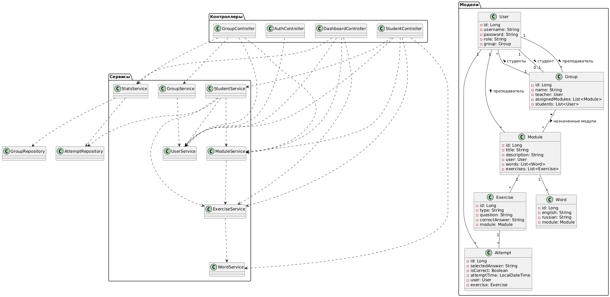

# Vocabulary Trainer - Дипломный проект

## 🎓 О проекте
Веб-приложение для изучения английской лексики, разработанное как дипломный проект. Преподаватели могут создавать модули со словами и упражнениями, а студенты - изучать слова и выполнять упражнения.

## 🚀 Основные функции

### Для преподавателей:
- 📚 Создание и управление модулями с словами
- 👥 Управление группами студентов
- ✅ Создание автоматических упражнений
- 📊 Просмотр статистики и результатов студентов
- 🎯 Назначение модулей группам

### Для студентов:
- 📖 Изучение слов с транскрипцией и озвучкой
- 🎮 Интерактивные упражнения
- 📈 Отслеживание прогресса
- 📊 Просмотр личной статистики

## 🛠 Технологии

- **Backend**: Java, Spring Boot, Spring Security, Spring Data JPA
- **Frontend**: Thymeleaf, Bootstrap 5, JavaScript
- **Database**: MySQL
- **Build Tool**: Maven
- **Security**: Spring Security с ролевой моделью (TEACHER/STUDENT)

## 🎯 Особенности реализации
- **Ролевая модель доступа**: разделение на преподавателей и студентов
- **Автогенерация упражнений**: создание вариантов заданий на основе слов
- **Web Speech API**: озвучка английских слов в браузере
- **Progress tracking**: отслеживание прогресса студентов
- **Responsive design**: адаптивный интерфейс для разных устройств

## 🏗️ Архитектура системы

### Диаграмма классов

**Описание архитектуры:**
- **Модели (Entities):** User, Group, Module, Word, Exercise, Attempt
- **Сервисы (Business Logic):** UserService, ModuleService, GroupService, etc.
- **Контроллеры (Web Layer):** AuthController, DashboardController, etc.
- **Репозитории (Data Access):** UserRepository, ModuleRepository, etc.